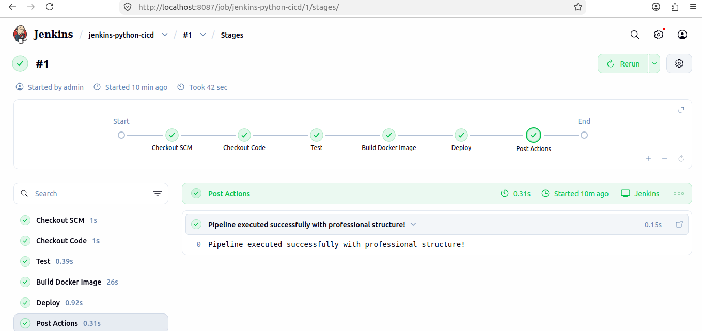
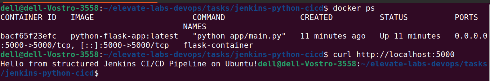

# Jenkins CI/CD Pipeline for Python Application

A light, production-ready Continuous Integration and Continuous Deployment (CI/CD) pipeline built with Jenkins and Docker to automate the testing, containerization, and deployment of a Python application.

---

## Objectives

- Automate build, test, and deployment workflows on code commits.

- Containerize the Python application using Docker.

- Enable zero-downtime container updates upon new releases.

---

## Technologies Used

- **Automation Server:** Jenkins
- **Containerization:** Docker
- **Programming Language:** Python 3.9
- **Web Framework:** Flask
- **Version Control:** Git & GitHub

---

## Repository Structure

```text
.
├── app/
│   └── main.py          # Python application source code
├── Dockerfile           # Docker image build configuration
├── Jenkinsfile          # Jenkins declarative pipeline definition
├── requirements.txt     # Python project dependencies
└── README.md            # Project documentation
```

---

## Pipeline Workflow

The declarative `Jenkinsfile` executes the following automated pipeline stages:

1. **Checkout SCM:** Fetches the latest source code from the primary `main` branch.
2. **Test:** Validates Python source code syntax using `py_compile`.
3. **Build Docker Image:** Builds the `python-flask-app:latest` container image.
4. **Deploy:** Stops any running container instances and starts a fresh application container on port `5000`.

---

## How to Run & Set Up

### 1. Prerequisites Setup

Ensure Jenkins user has Docker privileges:

```bash
sudo usermod -aG docker jenkins
sudo systemctl restart jenkins
```

### 2. Configure Jenkins Pipeline

1. Open Jenkins `http://localhost:8087` > **New Item**.
2. Select **Pipeline**, name it `jenkins-python-cicd`.
3. Under **Pipeline Definition**, select **Pipeline script from SCM**.
4. Set **SCM** to `Git`, add Repository URL: `https://github.com/PranayIngole7/jenkins-python-cicd.git`.
5. Set branch to `*/main` and Script Path to `Jenkinsfile`.
6. Click **Save** and select **Build Now**.

### 3. Verify Deployment
```bash
# Verify active Docker container
docker ps | grep flask-container

# Test local application response
curl http://localhost:5000

```
---

## Screenshots & Proof of Execution

**Jenkins Stage View (Build Success)**


**Docker Deployment Verification**

